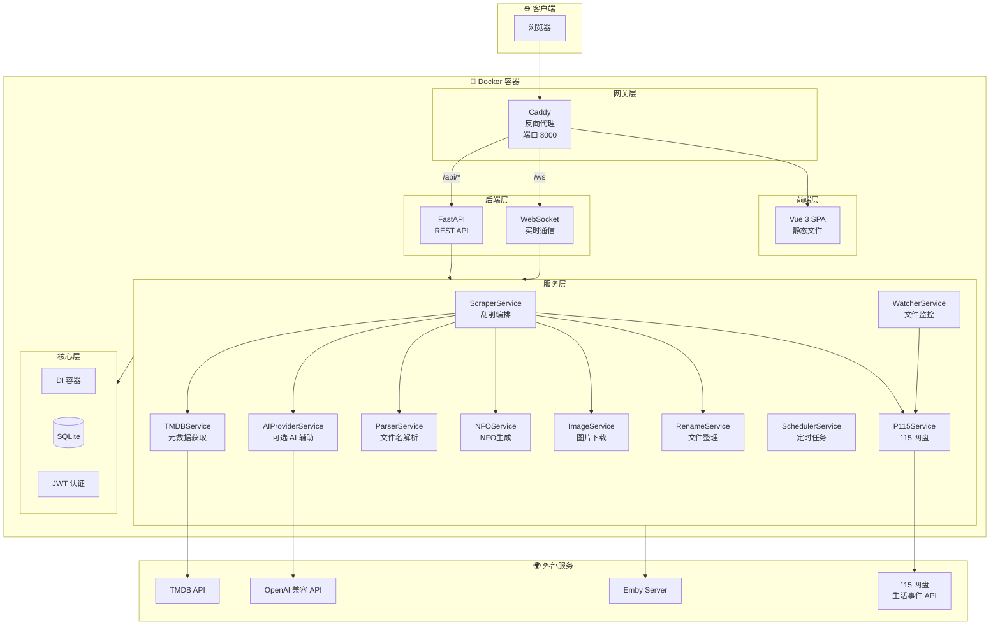
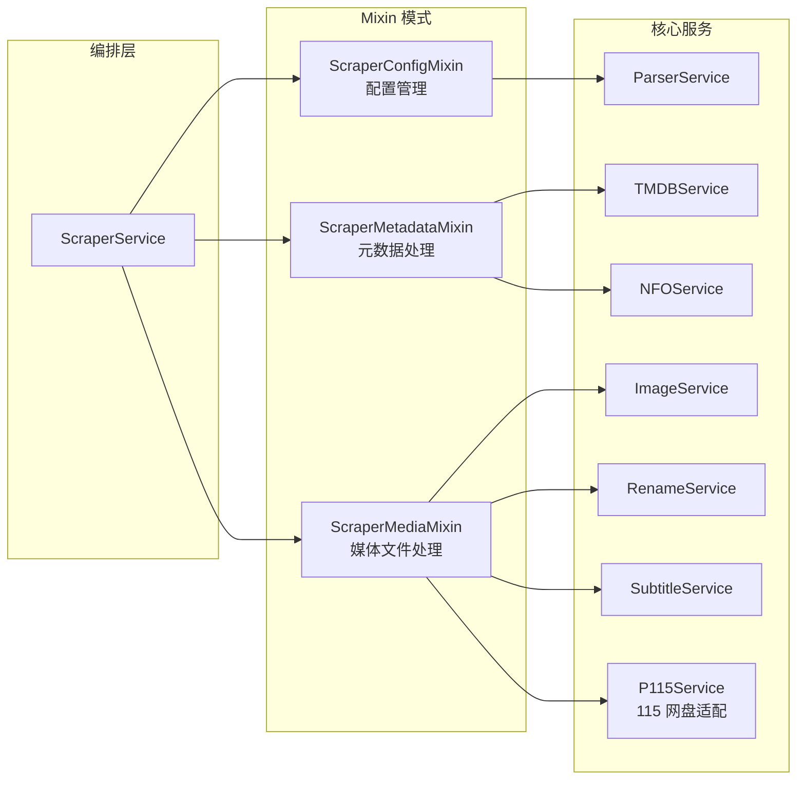
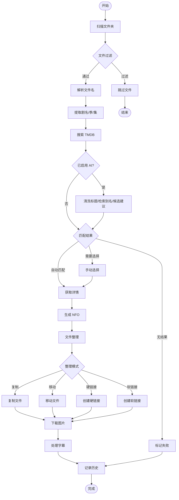
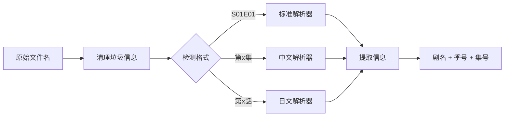
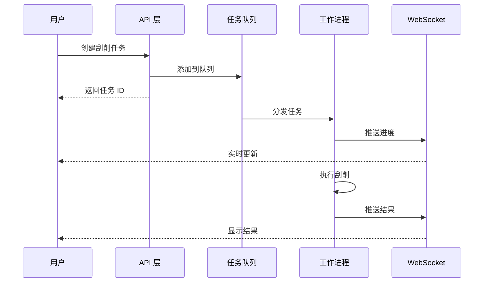
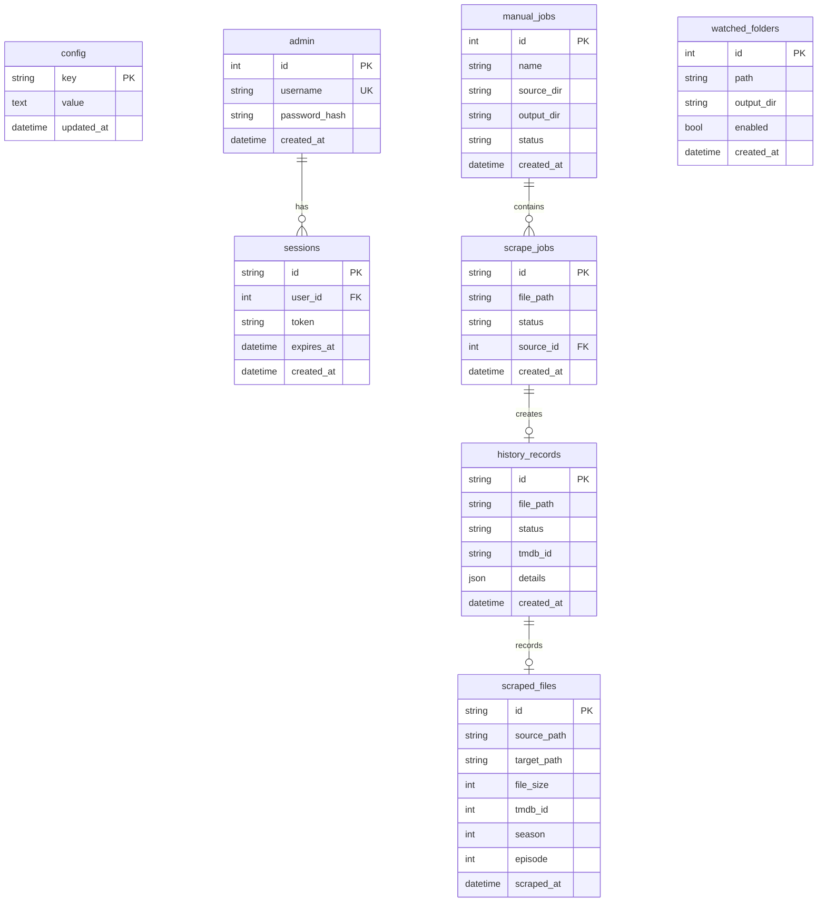

# MHTI - 媒体文件刮削与整理工具

<div align="center">


**自动从 TMDB 获取剧集元数据，智能整理媒体文件，支持日文动画与 `.strm` 媒体库**

[功能特性](#-功能特性) •
[快速开始](#-快速开始) •
[系统架构](#-系统架构) •
[API 文档](#-api-端点) •
[开发指南](#-开发指南)

</div>

---

## 📖 项目简介

MHTI 是一个全栈 Web 应用，专为媒体文件管理设计。它能够自动解析视频文件名，从 TMDB 获取元数据，生成 NFO 文件，并智能整理媒体库，兼容 Emby/Jellyfin 等媒体服务器。

除常规剧集外，MHTI 也面向日文动画文件名进行了优化：可识别常见字幕组标签、制作组标签、日文集数写法与 `.strm` 文件；可选的 OpenAI 兼容 AI 服务会在实际刮削流程中辅助清洗标题、生成 TMDB 检索别名并校验候选。

## ✨ 功能特性

| 功能模块 | 说明 |
|---------|------|
| 🎬 **文件名解析** | 智能解析标准、中文、日文动画等命名格式，自动提取剧名、季号和集号 |
| 🤖 **AI 辅助识别** | 支持 OpenAI 兼容接口，辅助清洗标题、生成检索别名并在 TMDB 候选中谨慎选择 |
| 🔍 **TMDB 集成** | 自动搜索匹配，获取剧集/电影元数据，核验季集存在性 |
| 📝 **NFO 生成** | 生成 Emby/Jellyfin 兼容的 NFO 文件 |
| 📁 **文件整理** | 支持复制/移动/硬链接/软链接四种模式 |
| ☁️ **115 网盘** | 扫码登录 115 网盘，支持 115→115/115→本地 整理 |
| 🖼️ **图片下载** | 自动下载海报、背景图、剧集缩略图 |
| 📺 **字幕关联** | 自动识别并关联同名字幕文件 |
| 👁️ **文件夹监控** | 实时/兼容/事件三种模式，支持本地与 115 网盘目录 |
| 🧾 **版本与去重** | 记录已成功整理的媒体身份，监控任务自动跳过已完成的同一源文件 |
| 🔗 **Emby 集成** | 媒体库冲突检测，避免重复 |
| 🔐 **安全认证** | JWT 认证，多会话管理 |
| 🌙 **主题切换** | 支持亮色/暗色主题 |

---

## 🏗️ 系统架构

### 整体架构图



### 服务层设计



---

## 🔄 业务流程

### 刮削工作流程



### 文件名解析流程



### 任务队列流程



---

## 📁 项目结构

```
MHTI/
├── 📂 server/                    # Python 后端
│   ├── 📂 api/                   # API 路由层
│   │   ├── auth.py               # 认证接口
│   │   ├── files.py              # 文件操作
│   │   ├── scraper.py            # 刮削接口
│   │   ├── config.py             # 配置管理
│   │   ├── tmdb.py               # TMDB 代理
│   │   ├── watcher.py            # 文件监控
│   │   └── websocket.py          # WebSocket
│   ├── 📂 core/                  # 核心层
│   │   ├── container.py          # 依赖注入容器
│   │   ├── database.py           # 数据库连接
│   │   ├── auth.py               # 认证逻辑
│   │   ├── middleware.py         # 中间件
│   │   └── 📂 db/                # 数据库模块
│   │       ├── connection.py     # 连接池
│   │       └── schema.py         # 表结构
│   ├── 📂 services/              # 业务服务层
│   │   ├── ai_provider_service.py # OpenAI 兼容 AI 服务
│   │   ├── scraper_service.py    # 刮削编排器
│   │   ├── tmdb_service.py       # TMDB 服务
│   │   ├── parser_service.py     # 解析服务
│   │   ├── nfo_service.py        # NFO 生成
│   │   ├── image_service.py      # 图片下载
│   │   ├── rename_service.py     # 文件整理
│   │   ├── p115_service.py       # 115 网盘服务
│   │   ├── watcher_service.py    # 文件监控（本地 + 115）
│   │   ├── scheduler_service.py  # 定时任务
│   │   └── 📂 parsers/           # 解析器集合
│   │       ├── cleaner.py         # 发布标签、画质与副标题清洗
│   │       ├── episode_standard.py
│   │       ├── episode_chinese.py
│   │       └── episode_japanese.py
│   ├── 📂 models/                # 数据模型
│   │   ├── scraper.py            # 刮削模型
│   │   ├── tmdb.py               # TMDB 模型
│   │   ├── file.py               # 文件模型
│   │   ├── cloud_115.py          # 115 网盘模型
│   │   ├── storage.py            # 存储定位模型
│   │   └── ...
│   └── 📂 tests/                 # 单元测试
├── 📂 web/                       # Vue.js 前端
│   ├── 📂 src/
│   │   ├── 📂 api/               # API 客户端
│   │   ├── 📂 views/             # 页面视图
│   │   │   ├── HomePage.vue      # 首页
│   │   │   ├── ScanPage.vue      # 手动任务
│   │   │   ├── HistoryPage.vue   # 刮削记录
│   │   │   ├── FilesPage.vue     # 文件管理
│   │   │   └── SettingsPage.vue  # 设置页面
│   │   ├── 📂 components/        # 组件库
│   │   │   ├── 📂 common/        # 通用组件
│   │   │   ├── 📂 layout/        # 布局组件
│   │   │   ├── 📂 scan/          # 扫描组件
│   │   │   ├── 📂 scrape/        # 刮削组件
│   │   │   └── 📂 settings/      # 设置组件
│   │   ├── 📂 stores/            # Pinia 状态
│   │   │   ├── auth.ts           # 认证状态
│   │   │   ├── scraper.ts        # 刮削状态
│   │   │   └── theme.ts          # 主题状态
│   │   ├── 📂 composables/       # 组合式函数
│   │   ├── 📂 utils/             # 工具函数
│   │   └── 📂 router/            # 路由配置
│   └── package.json
├── 📂 data/                      # 数据目录
│   └── scraper.db                # SQLite 数据库
├── docker-compose.yml            # Docker 编排
├── Dockerfile                    # 多阶段构建
├── Caddyfile                     # Caddy 配置
└── pyproject.toml                # Python 依赖
```

---

## 🚀 快速开始

### Docker 部署（推荐）

```bash
# 克隆仓库
git clone https://github.com/sfgawrgarf/MHTI.git
cd MHTI

# 创建本地持久化、源媒体和整理输出目录
mkdir -p data media output

# 构建并启动服务（Docker Compose v2）
docker compose up -d --build

# 查看日志
docker compose logs -f mhti

# 访问应用
# 主页: http://localhost:8000
# API 文档: http://localhost:8000/api/docs
```

如果系统仍使用旧版 Compose 命令，将上述 `docker compose` 替换为 `docker-compose` 即可。

### Docker Compose 配置

```yaml
services:
  mhti:
    build:
      context: .
    image: mhti:local
    container_name: mhti
    restart: unless-stopped
    ports:
      - "8000:8000"    # 主入口
    volumes:
      - ./data:/app/data              # 数据持久化
      - ./media:/media:ro             # 源媒体（只读）
      - ./output:/output              # 整理输出（可写）
    environment:
      - TZ=Asia/Shanghai
      - DATA_DIR=/app/data
```

生产环境可将 `./media` 和 `./output` 替换为宿主机绝对路径，例如 `/srv/media:/media:ro` 与 `/srv/mhti-output:/output`。不要把 API Key 写入 Compose 文件，请在网页“设置 → AI 识别”中保存。

### 开发模式

```bash
# 后端开发（方案 A：虚拟环境）
python -m venv .venv
# Windows
.\.venv\Scripts\activate
# macOS / Linux
source .venv/bin/activate
python -m pip install -r requirements.txt
python run_server.py --host 0.0.0.0 --port 8000 --reload

# 后端开发（方案 B：不使用虚拟环境）
python -m pip install --target .local_packages -r requirements.txt
python run_server.py --host 0.0.0.0 --port 8000 --reload

# 前端开发
cd web
npm install
npm run dev
```

说明：

- 方案 A 使用当前激活的虚拟环境。
- 方案 B 会把后端依赖安装到仓库根目录 `.local_packages/`，不需要创建或激活虚拟环境。
- `run_server.py` 会优先使用当前 Python 环境；若当前环境缺依赖，再回退到 `.local_packages/`。
- 为兼容早期说明，若仓库里已经存在 `.python_packages/`，启动脚本也会继续尝试它。
- 若只需本机访问，后端可改用 `--host 127.0.0.1`。

---

## 🌐 API 端点

### 认证模块 `/api/auth`

| 方法 | 路径 | 说明 |
|------|------|------|
| POST | `/login` | 用户登录 |
| POST | `/logout` | 用户登出 |
| POST | `/register` | 注册账户 |
| POST | `/refresh` | 刷新令牌 |
| GET | `/status` | 认证状态 |
| GET | `/sessions` | 会话列表 |

### 文件模块 `/api/files`

| 方法 | 路径 | 说明 |
|------|------|------|
| POST | `/scan` | 扫描文件夹 |
| GET | `/browse` | 浏览目录 |

### 刮削模块 `/api/scraper`

| 方法 | 路径 | 说明 |
|------|------|------|
| POST | `/scrape` | 执行刮削 |
| POST | `/scrape-by-id` | 按 TMDB ID 刮削 |
| GET | `/status` | 刮削状态 |

### 配置模块 `/api/config`

| 方法 | 路径 | 说明 |
|------|------|------|
| GET/PUT | `/tmdb` | TMDB 配置 |
| GET/PUT/DELETE | `/ai/config` | AI 辅助识别配置 |
| GET/PUT | `/proxy` | 代理设置 |
| GET/PUT | `/organize` | 整理配置 |
| GET/PUT | `/download` | 下载设置 |
| GET/PUT | `/nfo` | NFO 设置 |
| GET | `/115` | 115 登录状态 |
| GET | `/115/devices` | 115 登录设备列表 |
| POST | `/115/login/qrcode` | 115 扫码登录 |
| GET | `/115/login/status` | 115 登录状态轮询 |
| DELETE | `/115/login` | 115 退出登录 |

### 其他模块

| 路径 | 说明 |
|------|------|
| `/api/tmdb/*` | TMDB 代理接口 |
| `/api/ai/recognize` | 单文件 AI 辅助识别预览 |
| `/api/ai/versions/preview` | 媒体版本策略预览 |
| `/api/ai/versions/record` | 记录成功整理的媒体版本 |
| `/api/emby/*` | Emby 集成 |
| `/api/watcher/*` | 文件夹监控（本地 + 115） |
| `/api/history/*` | 历史记录 |
| `/api/manual-jobs/*` | 手动任务管理 |
| `/api/scheduler/*` | 定时任务 |
| `/ws` | WebSocket 实时通信 |
| `/health` | 健康检查 |

---

## 🎨 前端页面

| 路径 | 页面 | 功能 |
|------|------|------|
| `/` | 首页 | 统计概览、快捷入口 |
| `/login` | 登录 | 用户认证 |
| `/scan` | 手动任务 | 创建刮削任务 |
| `/history` | 刮削记录 | 查看历史记录 |
| `/files` | 文件管理 | 浏览媒体文件 |
| `/settings` | 设置 | 系统配置（含 115 网盘登录） |
| `/security` | 安全设置 | 账户管理 |

---

## 🛠️ 技术栈

### 后端

| 技术 | 版本 | 用途 |
|------|------|------|
| Python | 3.11+ | 运行时 |
| FastAPI | 0.109+ | Web 框架 |
| Uvicorn | 0.27+ | ASGI 服务器 |
| aiosqlite | 0.19+ | 异步 SQLite |
| httpx | 0.27+ | HTTP 客户端 |
| watchdog | 4.0+ | 文件监控 |
| python-jose | 3.3+ | JWT 认证 |
| Pydantic | 2.6+ | 数据验证 |
| p115client | 0.0.9.6.5.1 | 115 网盘客户端 |

### 前端

| 技术 | 版本 | 用途 |
|------|------|------|
| Vue | 3.5+ | 前端框架 |
| TypeScript | 5.9+ | 类型系统 |
| Vite | 7+ | 构建工具 |
| Pinia | 3.0+ | 状态管理 |
| Vue Router | 4.6+ | 路由管理 |
| Naive UI | 2.43+ | UI 组件库 |
| Axios | 1.13+ | HTTP 客户端 |

### 部署

| 技术 | 用途 |
|------|------|
| Docker | 容器化 |
| Caddy | 反向代理 |
| SQLite | 数据存储 |

---

## 📊 数据库设计

### 核心表结构



---

## ⚙️ 配置说明

### 整理模式

| 模式 | 说明 | 适用场景 |
|------|------|---------|
| `copy` | 复制文件 | 保留原文件 |
| `move` | 移动文件 | 节省空间 |
| `hardlink` | 硬链接 | 同分区节省空间（仅本地） |
| `symlink` | 软链接 | 跨分区引用（仅本地） |

### 115 网盘支持

| 功能 | 说明 |
|------|------|
| 扫码登录 | 在设置页扫码登录 115 网盘，cookies 加密存储 |
| 文件浏览 | 浏览 115 网盘目录，选择源/目标目录 |
| 115→115 整理 | 视频在 115 内整理（复制/移动+改名），NFO/图片留本地 |
| 115→本地整理 | 从 115 下载视频到本地后整理 |
| 监控模式 | 兼容模式（全量轮询）/ 事件模式（生活事件 API 增量监控） |
| TMDB 核验 | 整理前核验 TMDB 中季/集存在性，避免错误重命名 |

### 本地 `.strm` 与日文动画

将本地媒体目录挂载到容器内的 `/media`，将整理结果挂载到 `/output`。`.strm` 与常见视频文件会一并参与扫描；推荐使用 `copy` 模式，以保留原始 `.strm` 文件和原有目录结构。

日文动画文件名会先清理字幕组、制作组、日期、分辨率、语言及编码标签，再识别剧名与集数。支持的常见格式包括：

- `第N話`、`第N章`、`#N`、`Vol.N`；
- `N突き目`、`上巻`、`下巻`、前/后篇；
- `OVA日文标题`（按常见 TMDB 第一季结构处理）；
- `标题 1［副标题］` 这类全角方括号副标题格式。

解析结果仍会由 TMDB 的季/集信息核验；无法安全确定时会保留为待人工确认，而不是写入不确定的元数据。

### AI 辅助识别与多版本管理

在“设置 → AI 识别”中填写 OpenAI 兼容接口地址、模型和 API Key 后，AI 会在正常刮削中参与以下步骤：

1. 根据原始文件名和解析结果生成干净标题及 1–4 个 TMDB 检索别名；
2. 在 TMDB 候选中给出标题、季、集与候选建议；
3. 仅在达到配置的置信度阈值且通过 TMDB 季集核验时自动采用；低置信度结果保留人工选择。

AI 只提供结构化识别建议，不会自行删除、覆盖或移动源媒体。已成功整理的源文件会记录逻辑媒体身份与版本信息，监控任务会跳过同一源文件的重复投递。

若要从头重新刮削某一批文件，请先在网页删除对应记录；如果输出目录中已有同名整理结果，还需按需要清理该批输出文件，避免目标文件冲突。源目录保持只读时不会受影响。

### 环境变量

| 变量 | 默认值 | 说明 |
|------|--------|------|
| `DATA_DIR` | `/app/data` | 数据目录 |
| `TZ` | `Asia/Shanghai` | 时区 |

---

## 🧪 测试

```bash
# 安装运行与测试依赖（开发环境）
python -m pip install -r requirements.txt pytest pytest-cov

# 运行所有测试
python -m pytest

# 运行覆盖率测试
python -m pytest --cov=server --cov-report=html

# 运行特定测试
python -m pytest server/tests/services/test_parser_service.py -v
```

---

## 📝 开发规范

### 代码风格

- **Python**: Ruff + Black (line-length=100)
- **TypeScript**: ESLint + Prettier
- **类型注解**: 严格模式

### 命名约定

| 语言 | 风格 |
|------|------|
| Python | snake_case |
| TypeScript | camelCase |
| Vue 组件 | PascalCase |

### 提交规范

```
<type>(<scope>): <description>

类型:
- feat: 新功能
- fix: 修复
- docs: 文档
- style: 格式
- refactor: 重构
- test: 测试
- chore: 构建/工具
```

---

## 📄 许可证

本项目采用 MIT 许可证 - 详见 [LICENSE](LICENSE) 文件。

---

## 🤝 贡献

欢迎提交 Issue 和 Pull Request！

1. Fork 本仓库
2. 创建特性分支 (`git checkout -b feature/AmazingFeature`)
3. 提交更改 (`git commit -m 'feat: Add some AmazingFeature'`)
4. 推送到分支 (`git push origin feature/AmazingFeature`)
5. 创建 Pull Request

---

<div align="center">

**Made with ❤️ for media enthusiasts**

</div>


## 赞助作者

