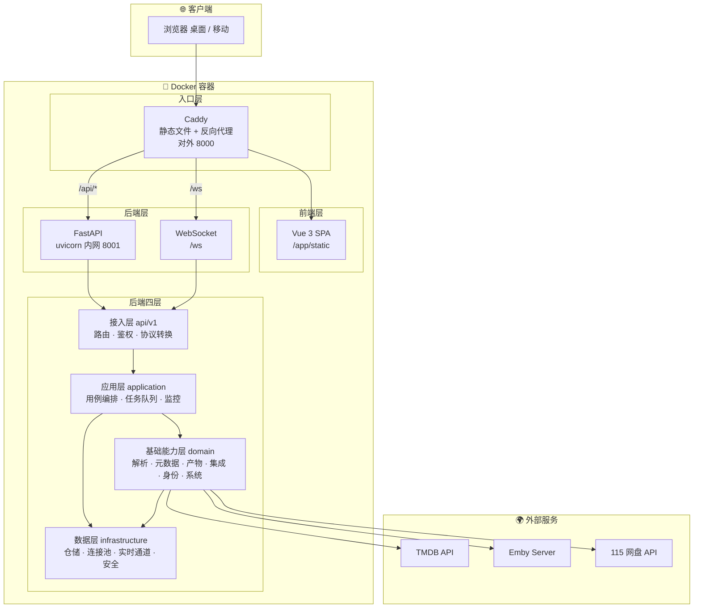
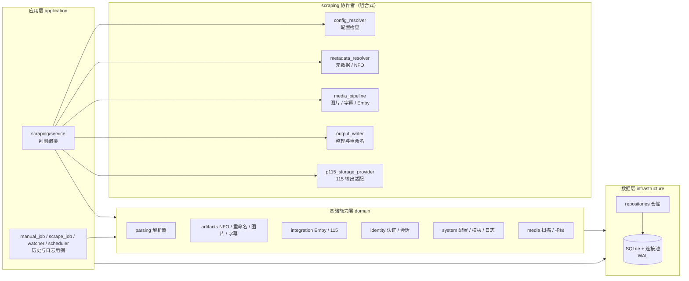
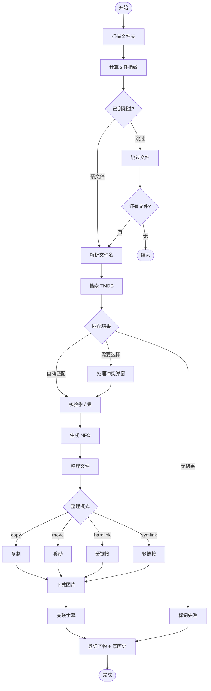
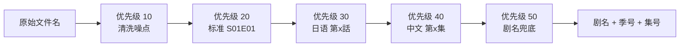
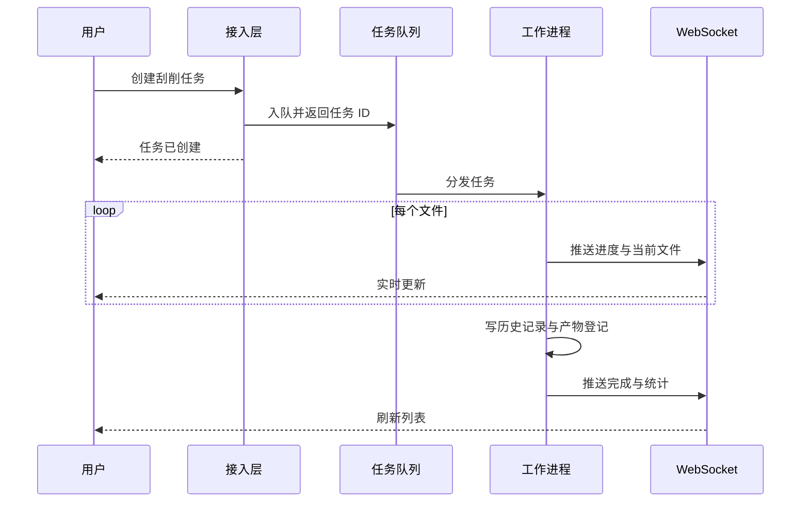
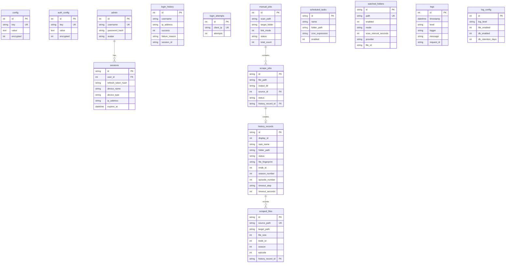

# MHTI - 媒体文件刮削与整理工具

<div align="center">


**自动从 TMDB 获取剧集元数据，智能整理媒体文件**

[功能特性](#-功能特性) •
[快速开始](#-快速开始) •
[系统架构](#-系统架构) •
[API 端点](#-api-端点) •
[开发指南](#-开发规范)

</div>

---

## 📖 项目简介

MHTI 是一个全栈 Web 应用，专为媒体文件管理设计。它能够自动解析视频文件名，从 TMDB 获取元数据，生成 NFO 文件，并智能整理媒体库，兼容 Emby/Jellyfin 等媒体服务器。支持本地目录与 115 网盘两种来源，视频可在线整理或下载后整理。

## ✨ 功能特性

| 功能模块 | 说明 |
|---------|------|
| 🎬 **文件名解析** | 插件式解析器（清洗 → 标准 → 日语 → 中文 → 剧名兜底），支持日期前缀、方括号结构、裸数字与全角井号集数、OVA/特别篇标记，自动修正季号 |
| 🔍 **TMDB 集成** | 搜索匹配、季/集存在性核验、手动搜索填 ID；认证检测含 Token 有效性与 R18 可见性两项 |
| 🧩 **处理冲突** | 匹配不到或匹配到多季时进入冲突步骤，逐级手动选择剧集/季/集，也支持沿用上次匹配直接重试 |
| 📝 **NFO 生成** | 生成 Emby/Jellyfin 兼容的剧集、季、单集 NFO |
| 📁 **文件整理** | 复制 / 移动 / 硬链接 / 软链接四种模式，可配置命名模板与过滤规则 |
| ☁️ **115 网盘** | 扫码登录，展示账号身份、会员、容量与登录设备；支持 115→115 在线整理与 115→本地下载整理 |
| 🖼️ **图片下载** | 自动下载海报、背景图、剧照与单集缩略图 |
| 📺 **字幕关联** | 识别同名字幕并批量关联、重命名 |
| 👁️ **目录监控** | 实时 / 兼容（全量轮询）/ 事件（115 生活事件增量）三种模式，支持本地与 115 目录 |
| 🔗 **Emby 集成** | 媒体库冲突检测与入库校验 |
| 🗂️ **任务与记录** | 手动任务、刮削任务、定时任务三类队列；记录支持实时进度、耗时跳动、超时节点定位 |
| ♻️ **记录级操作** | 重刮、重新整理、删除产物文件、撤销，列表支持多选批量重试 |
| 🔐 **安全认证** | JWT + 刷新令牌，多会话管理、登录历史与失败次数限制 |
| 📋 **日志管理** | 分级落库，支持级别/模块/关键词/时间筛选、指标条、保留策略与导出 |
| 🌙 **界面** | 六域模块化前端、亮/暗主题、⌘K 命令面板、移动端底部 TabBar、列表页统一「单卡框架」 |

---

## 🏗️ 系统架构

### 整体架构图


```mermaid
graph TB
    subgraph Client["🌐 客户端"]
        Browser[浏览器 桌面 / 移动]
    end

    subgraph Docker["🐳 Docker 容器"]
        subgraph Gateway["入口层"]
            Caddy[Caddy<br/>静态文件 + 反向代理<br/>对外 8000]
        end

        subgraph Frontend["前端层"]
            Vue["Vue 3 SPA<br/>/app/static"]
        end

        subgraph Backend["后端层"]
            FastAPI["FastAPI<br/>uvicorn 内网 8001"]
            WebSocket["WebSocket<br/>/ws"]
        end

        subgraph Layers["后端四层"]
            ApiLayer["接入层 api/v1<br/>路由 · 鉴权 · 协议转换"]
            AppLayer["应用层 application<br/>用例编排 · 任务队列 · 监控"]
            DomainLayer["基础能力层 domain<br/>解析 · 元数据 · 产物 · 集成 · 身份 · 系统"]
            InfraLayer["数据层 infrastructure<br/>仓储 · 连接池 · 实时通道 · 安全"]
        end
    end

    subgraph External["🌍 外部服务"]
        TMDB[TMDB API]
        Emby[Emby Server]
        P115["115 网盘 API"]
    end

    Browser --> Caddy
    Caddy --> Vue
    Caddy -->|/api/*| FastAPI
    Caddy -->|/ws| WebSocket
    FastAPI --> ApiLayer
    WebSocket --> ApiLayer
    ApiLayer --> AppLayer
    AppLayer --> DomainLayer
    AppLayer --> InfraLayer
    DomainLayer --> InfraLayer
    DomainLayer --> TMDB
    DomainLayer --> Emby
    DomainLayer --> P115
```

开发模式下没有 Caddy：Vite dev server 跑 3000 端口并把 `/api`、`/ws` 代理到后端 8000。

### 分层与刮削协作


```mermaid
graph LR
    subgraph AppLayer["应用层 application"]
        Scraper["scraping/service<br/>刮削编排"]
        Jobs["manual_job / scrape_job / watcher / scheduler<br/>历史与日志用例"]
    end

    subgraph Collaborators["scraping 协作者（组合式）"]
        Config["config_resolver<br/>配置检查"]
        Metadata["metadata_resolver<br/>元数据 / NFO"]
        Media["media_pipeline<br/>图片 / 字幕 / Emby"]
        Writer["output_writer<br/>整理与重命名"]
        Storage["p115_storage_provider<br/>115 输出适配"]
    end

    subgraph DomainLayer["基础能力层 domain"]
        Parsing["parsing 解析器"]
        Artifacts["artifacts NFO / 重命名 / 图片 / 字幕"]
        Integrations["integration Emby / 115"]
        Identity["identity 认证 / 会话"]
        System["system 配置 / 模板 / 日志"]
        Media2["media 扫描 / 指纹"]
    end

    subgraph InfraLayer["数据层 infrastructure"]
        Repos["repositories 仓储"]
        DB[("SQLite + 连接池<br/>WAL")]
    end

    Scraper --> Config
    Scraper --> Metadata
    Scraper --> Media
    Scraper --> Writer
    Scraper --> Storage
    Scraper --> DomainLayer
    Jobs --> DomainLayer
    DomainLayer --> InfraLayer
    AppLayer --> InfraLayer
    Repos --> DB
```

---

## 🔄 业务流程

### 刮削工作流程


```mermaid
flowchart TD
    Start([开始]) --> Scan[扫描文件夹]
    Scan --> Fingerprint[计算文件指纹]
    Fingerprint --> Dedup{已刮削过?}
    Dedup -->|跳过| Skip[跳过文件]
    Dedup -->|新文件| Parse[解析文件名]
    Parse --> Search[搜索 TMDB]

    Search --> Match{匹配结果}
    Match -->|自动匹配| Verify[核验季 / 集]
    Match -->|需要选择| Conflict[处理冲突弹窗]
    Match -->|无结果| Failed[标记失败]

    Conflict --> Verify
    Verify --> GenNFO[生成 NFO]
    GenNFO --> Organize[整理文件]

    Organize --> Mode{整理模式}
    Mode -->|copy| Copy[复制]
    Mode -->|move| Move[移动]
    Mode -->|hardlink| HardLink[硬链接]
    Mode -->|symlink| SymLink[软链接]

    Copy --> Download[下载图片]
    Move --> Download
    HardLink --> Download
    SymLink --> Download

    Download --> Subtitle[关联字幕]
    Subtitle --> Record[登记产物 + 写历史]
    Record --> Success([完成])

    Failed --> Record
    Skip --> Next{还有文件?}
    Next -->|有| Parse
    Next -->|无| End([结束])
```

任务整体受「任务超时」阈值约束（系统设置，下限 10 秒）。触发超时时记录 `status=timeout`，并落库最后执行到的步骤与当时的阈值快照，详情页单列「超时详情」。

### 文件名解析流程


```mermaid
flowchart LR
    Input[原始文件名] --> Clean["优先级 10<br/>清洗噪点"]
    Clean --> Standard["优先级 20<br/>标准 S01E01"]
    Standard --> Japanese["优先级 30<br/>日语 第x話"]
    Japanese --> Chinese["优先级 40<br/>中文 第x集"]
    Chinese --> Fallback["优先级 50<br/>剧名兜底"]
    Fallback --> Output["剧名 + 季号 + 集号"]
```

解析器按优先级串行尝试，命中即返回。解析出的季/集只作为预选默认值，用户在向导里的选择不会被覆盖；OVA/OAD/ONA/特別編 属于发行形态，不落成第 0 季。

### 任务队列流程


```mermaid
sequenceDiagram
    participant User as 用户
    participant API as 接入层
    participant Queue as 任务队列
    participant Worker as 工作进程
    participant WS as WebSocket

    User->>API: 创建刮削任务
    API->>Queue: 入队并返回任务 ID
    API-->>User: 任务已创建
    Queue->>Worker: 分发任务
    loop 每个文件
        Worker->>WS: 推送进度与当前文件
        WS-->>User: 实时更新
    end
    Worker->>Worker: 写历史记录与产物登记
    Worker->>WS: 推送完成与统计
    WS-->>User: 刷新列表
```

---

## 📁 项目结构

```
MHTI/
├── server/                       # Python 后端（四层架构）
│   ├── main.py                   # 应用入口（FastAPI 装配、路由挂载）
│   ├── bootstrap.py              # 组合根：DI 容器与服务工厂
│   ├── common/                   # 共享内核（异常体系、HTTP 工具）
│   ├── api/                      # 接入层
│   │   ├── deps.py               # 鉴权依赖
│   │   ├── middleware.py         # 中间件与异常处理器
│   │   └── v1/                   # 版本化路由（20 个模块，约 120 个端点）
│   ├── application/              # 应用层（用例编排）
│   │   ├── scraping/             # 刮削编排 + 协作者（配置/元数据/管线/输出/115）
│   │   ├── manual_job_service.py # 手动任务队列
│   │   ├── scrape_job_service.py # 刮削任务队列
│   │   ├── watcher_service.py    # 目录监控
│   │   ├── history_service.py    # 历史记录
│   │   └── scheduler_service.py  # 定时任务
│   ├── domain/                   # 基础能力层
│   │   ├── parsing/              # 文件名解析（插件式 parsers/）
│   │   ├── metadata/             # TMDB 元数据
│   │   ├── artifacts/            # NFO / 重命名 / 图片 / 字幕
│   │   ├── media/                # 文件扫描 / 指纹
│   │   ├── integration/          # Emby / 115 网盘
│   │   ├── identity/             # 认证 / 会话
│   │   └── system/               # 配置 / 模板 / 日志
│   ├── infrastructure/           # 数据层
│   │   ├── db/                   # 连接池与表结构
│   │   ├── repositories/         # 仓储（各表 DDL 与迁移就地维护）
│   │   ├── realtime.py           # WebSocket 连接管理
│   │   └── ...                   # 安全 / 缓存 / 日志落库 / 应用配置
│   ├── models/                   # 领域模型（Pydantic）
│   └── tests/                    # 测试（含分层架构断言）
├── web/                          # Vue 3 前端
│   ├── src/
│   │   ├── config/               # 运行时配置
│   │   ├── shared/               # 跨域共享：api / components / composables / styles / types / utils
│   │   ├── layouts/              # 应用壳：顶部导航、命令面板、移动端 TabBar
│   │   ├── router/               # 路由聚合（shell.ts）与菜单真源
│   │   ├── stores/               # Pinia：认证 / 主题
│   │   └── modules/              # 六业务域：auth / home / scrape / history / library / settings
│   │       └── <域>/             # api.ts · routes.ts · components · hooks · views · types
│   └── package.json
├── data/                         # 运行时数据（SQLite、日志）
├── Dockerfile                    # 多阶段构建（Node 构建前端 + Python 运行时 + Caddy）
├── docker-compose.yml            # 容器编排
├── Caddyfile                     # 反向代理与静态文件
├── start.sh                      # 容器启动脚本（Caddy + uvicorn）
├── run_server.py                 # 本机启动脚本
├── requirements.txt              # 后端依赖（Docker 使用）
└── pyproject.toml                # 项目元数据与开发依赖
```

---

## 🚀 快速开始

### Docker 部署（推荐）

```bash
# 克隆仓库
git clone https://github.com/sfgawrgarf/MHTI.git
cd MHTI

# 创建持久化、源媒体和整理输出目录
mkdir -p data media output

# 默认使用已发布的固定版本；升级时显式指定目标版本
export MHTI_VERSION=2.1.6

# 拉取固定版本镜像并启动服务（Docker Compose v2）
docker compose pull
docker compose up -d

# 查看日志
docker compose logs -f mhti

# 访问应用
# 主页: http://localhost:8000
# API 文档: http://localhost:8000/api/docs
```

首次启动后打开首页，按引导完成 TMDB Token 配置即可开始刮削。

### Docker Compose 配置

```yaml
services:
  mhti:
    image: ghcr.io/sfgawrgarf/mhti:${MHTI_VERSION:-2.1.6}
    container_name: mhti
    restart: unless-stopped
    ports:
      - "8000:8000"                   # 唯一对外入口（Caddy）
    volumes:
      - ./data:/app/data              # 数据持久化
      - ./media:/media:ro             # 源媒体（只读）
      - ./output:/output              # 整理输出
      - ./Caddyfile:/etc/caddy/Caddyfile:ro
    environment:
      - DATA_DIR=/app/data
      - TZ=Asia/Shanghai
      - MHTI_ALLOWED_MEDIA_ROOTS=/media,/output
```

默认 Compose 文件使用 GHCR 固定版本镜像；源码开发或验证容器构建时，使用
`docker compose -f docker-compose.yml -f docker-compose.dev.yml up -d --build`。
容器内 Caddy 监听 8000，uvicorn 只监听 `127.0.0.1:8001`，前端静态文件由 Caddy 直接提供。

### 开发模式

```bash
# 后端（工作目录：项目根）
python -m venv .venv
.\.venv\Scripts\activate            # macOS / Linux: source .venv/bin/activate
python -m pip install -r requirements.txt
python -m uvicorn server.main:app --host 127.0.0.1 --port 8000

# 前端（工作目录：web/）
npm install
npm run dev                         # http://127.0.0.1:3000，/api 与 /ws 代理到 8000

# 前端提交前必跑：类型检查 + 构建
npm run build:check
```

说明：

- `run_server.py` 会优先使用当前 Python 环境，缺依赖时回退到 `.local_packages/`（可用 `pip install --target .local_packages -r requirements.txt` 安装）。
- 后端入口统一为 `server.main:app`；Docker 内由 `start.sh` 同时拉起 uvicorn 与 Caddy。
- 本机直连 `api.themoviedb.org` 不通时，需带代理启动后端，否则刮削一律 502：

```bash
HTTP_PROXY=http://127.0.0.1:10808 HTTPS_PROXY=http://127.0.0.1:10808 \
ALL_PROXY=http://127.0.0.1:10808 \
python -m uvicorn server.main:app --host 127.0.0.1 --port 8000
```

---

## 🌐 API 端点

所有接口以 `/api` 为前缀（WebSocket 为 `/ws`），文档见 `/api/docs`。除登录与健康检查外均需 JWT 认证。

### 认证 `/api/auth`

| 方法 | 路径 | 说明 |
|------|------|------|
| POST | `/register` | 注册账户 |
| POST | `/login` | 登录，返回访问令牌与刷新令牌 |
| POST | `/refresh` | 刷新令牌 |
| POST | `/logout` | 登出 |
| GET | `/status` | 认证状态 |
| GET | `/verify` | 校验令牌 |
| GET | `/profile` | 当前账户信息 |
| GET | `/history` | 登录历史 |
| GET/PUT/DELETE | `/avatar` | 头像读写 |
| PUT | `/password` · `/username` | 修改密码 / 用户名 |
| GET | `/sessions` | 会话列表 |
| DELETE | `/sessions` · `/sessions/{id}` | 注销全部 / 指定会话 |

### 配置 `/api/config`

| 方法 | 路径 | 说明 |
|------|------|------|
| GET/PUT/DELETE | `/proxy` | 代理设置 |
| POST | `/proxy/test` | 代理连通性测试 |
| GET/PUT | `/language` | 元数据语言 |
| POST/GET/DELETE | `/api-token` · `/api-token/status` | TMDB Token 保存与状态 |
| POST | `/api-token/verify` | 重新验证 Token 与 R18 可见性 |
| GET/PUT | `/organize` | 整理模式与过滤规则 |
| GET/PUT | `/download` | 下载范围（海报/背景/剧照/字幕） |
| GET/PUT | `/naming` | 命名模板与重命名规则 |
| GET/PUT | `/nfo` | NFO 字段与图片类型 |
| GET/PUT | `/watcher-config` | 监控扫描方式与入库时机 |
| GET/PUT | `/system` | 系统参数（并发、任务超时等） |
| GET | `/frontend` | 前端运行时配置 |
| GET | `/115` · `/115/account` · `/115/devices` | 115 登录状态 / 账号详情 / 设备列表 |
| POST | `/115/login/qrcode` | 生成登录二维码 |
| GET | `/115/login/status` | 扫码状态轮询 |
| DELETE | `/115/login` | 退出登录 |

### 文件与解析

| 方法 | 路径 | 说明 |
|------|------|------|
| POST | `/api/scan` | 扫描文件夹 |
| GET | `/api/files/browse` | 浏览目录（本地 / 115） |
| POST | `/api/parse` · `/api/parse/batch` | 解析文件名（单个 / 批量） |

### 刮削 `/api/scraper`

| 方法 | 路径 | 说明 |
|------|------|------|
| GET | `/status` | 刮削状态 |
| POST | `/preview` | 预演（不落盘） |
| POST | `/file` · `/file/by-id` | 刮削单个文件（按路径 / 按 TMDB ID） |
| POST | `/batch` | 批量刮削 |

### 任务

| 方法 | 路径 | 说明 |
|------|------|------|
| POST/GET/DELETE | `/api/manual-jobs` · `/api/manual-jobs/{id}` | 手动任务创建 / 列表 / 详情 / 清理 |
| POST/GET/DELETE | `/api/scrape-jobs` · `/api/scrape-jobs/{id}` | 刮削任务创建 / 列表 / 详情 / 清理 |
| GET/POST/PUT/DELETE | `/api/scheduler` · `/api/scheduler/{id}` | 定时任务增删改查 |
| POST | `/api/scheduler/{id}/toggle` | 启用 / 停用定时任务 |
| GET/POST | `/api/watcher/status` · `/start` · `/stop` | 监控开关与状态 |
| GET/POST/PUT/DELETE | `/api/watcher/folders` · `/{id}` | 监控目录增删改查 |

### 历史与产物

| 方法 | 路径 | 说明 |
|------|------|------|
| GET/POST/DELETE | `/api/history` | 记录列表 / 新建 / 批量删除 |
| GET/DELETE | `/api/history/{id}` | 记录详情 / 删除 |
| GET | `/api/history/{id}/logs/stream` | 刮削日志 SSE 实时流 |
| GET | `/api/history/export` | 导出记录 |
| POST | `/api/history/undo` | 撤销上一次操作 |
| PUT | `/api/history/{id}/resolve` | 提交冲突处理结果 |
| POST | `/api/history/{id}/retry` | 重试（沿用已存匹配） |
| GET | `/api/history/{id}/files` | 记录关联的源文件与产物 |
| POST | `/api/history/{id}/files/delete` | 删除产物文件 |
| POST | `/api/history/{id}/reorganize` | 按记录重新整理 |
| GET | `/api/tmdb/search` · `/series/{id}` · `/series/{id}/season/{n}` | TMDB 搜索 / 剧集详情 / 季详情 |
| POST | `/api/images/download` · `/batch` | 图片下载 |
| POST | `/api/nfo/tvshow` · `/season` · `/episode` | NFO 生成 |
| POST | `/api/subtitles/scan` · `/associate` · `/rename` · `/rename/batch` | 字幕扫描 / 关联 / 重命名 |
| POST | `/api/rename/preview` · `/execute` · `/batch` | 重命名预演与执行 |
| GET/POST | `/api/templates/default` · `/preview` · `/validate` | 命名模板 |

### 集成与运维

| 方法 | 路径 | 说明 |
|------|------|------|
| GET/PUT | `/api/emby/config` | Emby 配置 |
| GET | `/api/emby/status` | Emby 连接状态 |
| POST | `/api/emby/test` · `/check-conflict` | 连接测试 / 冲突检测 |
| GET | `/api/logs` · `/stats` · `/loggers` | 日志查询 / 指标 / logger 列表 |
| GET/PUT | `/api/logs/config` | 日志级别与保留策略 |
| DELETE | `/api/logs` · POST `/api/logs/cleanup` | 清空 / 按策略清理 |
| GET | `/api/logs/export` | 日志导出 |
| WS | `/ws` | WebSocket 实时通道 |
| GET | `/health` | 存活检查 |
| GET | `/health/ready` | 就绪检查 |

---

## 🎨 前端页面

| 路径 | 页面 | 功能 |
|------|------|------|
| `/` | 首页 | 统计概览、最近任务、TMDB 配置引导 |
| `/scan` | 手动任务 | 向导式创建刮削任务、任务进度与结果 |
| `/history` | 刮削记录 | 列表、筛选、多选批量重试、导出 |
| `/history/:id` | 记录详情 | 元数据卡、刮削日志时间轴、超时详情、记录级操作 |
| `/files` | 文件管理 | 目录浏览（本地 / 115）、发起整理任务 |
| `/filemanager/scan` | 扫描结果 | 目录扫描结果与建任务入口（沿用遗留路径） |
| `/settings` | 设置 | 左侧分组导航 + 右侧面板（整理/监控/下载/命名/NFO/代理/115/Emby/系统/日志） |
| `/security` | 安全设置 | 账户、密码、会话与登录历史 |
| `/login` | 登录 | 用户认证（全页路由，不套应用壳） |

界面语言：中文。导航、命令面板（⌘K / Ctrl+K）与移动端底部 TabBar 均由路由 meta 驱动。

---

## 🛠️ 技术栈

### 后端

| 技术 | 版本 | 用途 |
|------|------|------|
| Python | 3.12+ | 运行时 |
| FastAPI | 0.109+ | Web 框架 |
| Uvicorn | 0.27+ | ASGI 服务器 |
| Pydantic | 2.6+ | 数据验证 |
| aiosqlite | 0.19+ | 异步 SQLite（手写 SQL + 仓储层） |
| httpx[socks] | 0.27+ | HTTP 客户端（支持代理） |
| watchdog | 4.0+ | 本地目录监控 |
| croniter | 2.0+ | 定时任务表达式 |
| sse-starlette | 2.0+ | 日志与进度 SSE |
| PyJWT | 2.10+ | JWT 认证 |
| cryptography | 49.0+ | 敏感配置加密 |
| p115client | 0.0.9.6.5.1 | 115 网盘客户端（版本需与 requirements 严格对齐） |

### 前端

| 技术 | 版本 | 用途 |
|------|------|------|
| Vue | 3.5 | 前端框架 |
| TypeScript | 5.9 | 类型系统 |
| Vite | 7.2 | 构建工具（构建期 Node 24） |
| Pinia | 3.0 | 状态管理 |
| Vue Router | 4.6 | 路由管理 |
| Naive UI | 2.43 | UI 组件库 |
| Axios | 1.13 | HTTP 客户端 |
| qrcode | 1.5 | 登录二维码生成 |

### 部署

| 技术 | 用途 |
|------|------|
| Docker（多阶段构建） | 容器化，Node 构建前端 + Python 运行时 |
| Caddy | 反向代理、静态文件、gzip、WebSocket 长连接 |
| SQLite（WAL） | 数据存储 |

---

## 📊 数据库设计

SQLite 单文件（`data/scraper.db`，WAL 模式，连接池 5），共 14 张表。表结构与增量列由各自仓储就地维护。


```mermaid
erDiagram
    config {
        int id PK
        string key UK
        text value
        int encrypted
    }

    auth_config {
        int id PK
        string key UK
        text value
        int encrypted
    }

    admin {
        int id PK
        string username UK
        string password_hash
        string avatar
    }

    sessions {
        string id PK
        int user_id FK
        string refresh_token_hash
        string device_name
        string device_type
        string ip_address
        datetime expires_at
    }

    login_history {
        int id PK
        string username
        string ip_address
        int success
        string failure_reason
        string session_id
    }

    login_attempts {
        int id PK
        string client_ip UK
        int attempts
    }

    manual_jobs {
        int id PK
        string scan_path
        string target_folder
        int link_mode
        string status
        int total_count
    }

    scrape_jobs {
        string id PK
        string file_path
        string output_dir
        int source_id FK
        string status
        string history_record_id FK
    }

    history_records {
        string id PK
        int display_id
        string task_name
        string folder_path
        string status
        string file_fingerprint
        int tmdb_id
        int season_number
        int episode_number
        string timeout_step
        int timeout_seconds
    }

    scraped_files {
        string id PK
        string source_path UK
        string target_path
        int file_size
        int tmdb_id
        int season
        int episode
        string history_record_id FK
    }

    scheduled_tasks {
        string id PK
        string name
        string folder_path
        string cron_expression
        int enabled
    }

    watched_folders {
        string id PK
        string path UK
        int enabled
        string mode
        int scan_interval_seconds
        string provider
        string file_id
    }

    logs {
        int id PK
        datetime timestamp
        string level
        string logger
        string message
        string request_id
    }

    log_config {
        int id PK
        string log_level
        int file_enabled
        int db_enabled
        int db_retention_days
    }

    admin ||--o{ sessions : has
    manual_jobs ||--o{ scrape_jobs : contains
    scrape_jobs ||--o| history_records : creates
    history_records ||--o{ scraped_files : records
```

`scraped_files` 记录整理产物的源路径与目标路径，供「删除文件 / 重新整理 / 重刮」定位；是否重复刮削由 `history_records.file_fingerprint` 判定。

---

## ⚙️ 配置说明

### 整理模式

| 模式 | 值 | 说明 | 适用场景 |
|------|----|------|---------|
| 复制 | `copy` | 复制文件 | 保留原文件 |
| 移动 | `move` | 移动文件 | 节省空间 |
| 硬链接 | `hardlink` | 创建硬链接 | 同分区节省空间（仅本地） |
| 软链接 | `symlink` | 创建软链接 | 跨分区引用（仅本地） |

### 115 网盘支持

| 功能 | 说明 |
|------|------|
| 扫码登录 | 设置页生成二维码，cookies 加密存储 |
| 账号信息 | 展示身份、会员等级与到期时间、容量占用、当前登录设备 |
| 文件浏览 | 浏览 115 目录并选择源/目标目录，含目录缓存与悬停预取 |
| 115→115 整理 | 视频在 115 内复制/移动并改名，NFO 与图片留本地 |
| 115→本地整理 | 从 115 下载视频到本地后整理 |
| 监控模式 | 兼容模式（全量轮询）/ 事件模式（生活事件 API 增量监控） |
| 限流提示 | `fs_files` 请求过密会返回 405，前端提示稍后重试 |

### 环境变量

| 变量 | 默认值 | 说明 |
|------|--------|------|
| `DATA_DIR` | `/app/data` | 数据目录（SQLite 与日志） |
| `TZ` | `Asia/Shanghai` | 时区 |
| `APP_VERSION` | 代码内置版本 | 覆盖前端运行时展示的版本号 |

其余配置（TMDB Token、代理、整理与命名规则、监控、Emby、日志级别等）均在设置页维护，落库于 `config` / `log_config` 表。

---

## 🧪 测试

```bash
# 全量后端测试（工作目录：项目根）
python -m pytest server/tests -q        # 基线：530 passed

# 覆盖率
python -m pytest --cov=server --cov-report=html

# 单个文件
python -m pytest server/tests/domain/test_parser_service.py -v
```

测试使用临时库隔离，不受 `data/scraper.db` 当前内容影响。测试目录含 `test_architecture.py`，对分层依赖方向做断言。

前端暂无自动化测试，改动以 `npm run build:check`（`vue-tsc -b && vite build`）为硬门禁，并在浏览器中实测。

---

## 📝 开发规范

### 代码风格

- **Python**: Ruff + Black（line-length=100）
- **TypeScript**: ESLint + Prettier，严格类型
- **Vue**: `<script setup>` 单文件组件，样式使用设计令牌（`shared/styles/design-tokens.css`）

### 前端分层

依赖只能同层或向下：`Views → Modules → Components → Utils/Hooks/Config → Api`。跨业务域调用只允许走对方 `index.ts` 白名单或全局 Pinia，禁止跨域深路径导入；端点字符串只出现在 `api.ts` 与 `shared/api/*`。

### 命名约定

| 语言 | 风格 |
|------|------|
| Python | snake_case |
| TypeScript | camelCase |
| Vue 组件 | PascalCase |

### 提交规范

```
<type>(<scope>): <description>

类型:
- feat: 新功能
- fix: 修复
- docs: 文档
- style: 格式
- refactor: 重构
- test: 测试
- chore: 构建/工具
```

---

## 📄 许可证

本项目采用 MIT 许可证 - 详见 [LICENSE](LICENSE) 文件。

---

## 🤝 贡献

欢迎提交 Issue 和 Pull Request！

1. Fork 本仓库
2. 创建特性分支 (`git checkout -b feature/AmazingFeature`)
3. 提交更改 (`git commit -m 'feat: Add some AmazingFeature'`)
4. 推送到分支 (`git push origin feature/AmazingFeature`)
5. 创建 Pull Request

---

<div align="center">

**Made with ❤️ for media enthusiasts**

</div>


## 赞助作者

